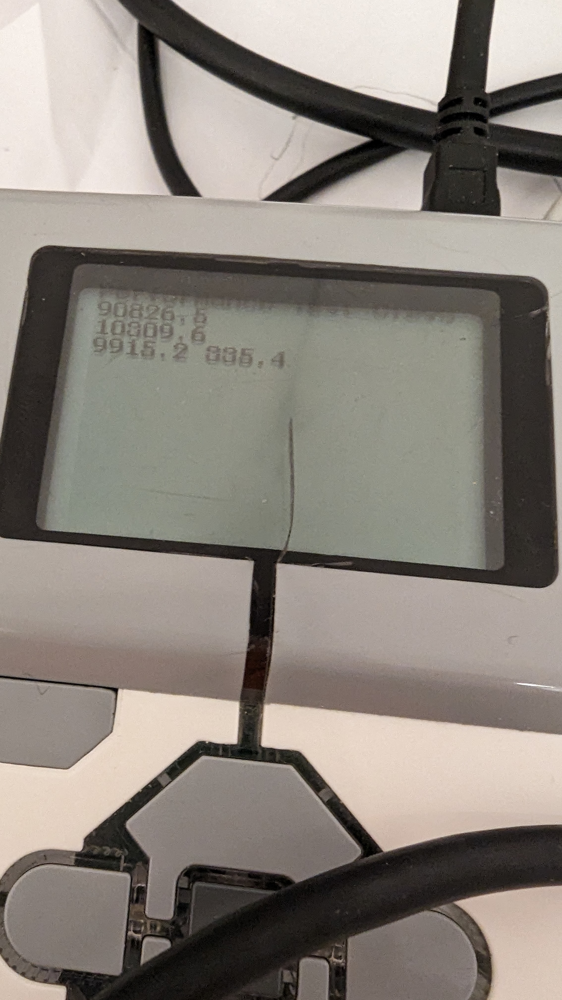

# EV3 Performance Tests
Тесты производительности EV3 на разных языках программирования

## Методика тестирования
Тестирование проводилось по трём сценариям:
1. **Скорость обновления на холостом ходу**. Запускается цикл на 100000 итераций. По окончании работы цикла делим число итераций на время, чтобы получить скорость обновления на холостом ходу.
2. **Скорость чтения с датчика цвета EV3**. Режим работы датчика - Raw Reflected, как самый быстрый. В цикле считываем показания с датчика и добавляем к аккумулятору. Считывание производим в течении 5 секунд. Получинное число итераций делим на 5.
3. **Скорость чтения уникальных значений с датчика цвета EV3**. Тест аналочен второму, но добавляется подсчёт уникальных значений: обновляем счётчик, если предыдущее значение с датчика отличается от нового. Датчик цвета во время тестирования постоянно перемещался между чёрным и белым цветом.
4. **Скорость чтения уникальных значений энкодера с двух моторов**. Используется пара моторов BC.

Тест запускался несколько раз, выбирался лучший результат или близкий к нему. Bluetooth на EV3 во время запуска был отключен.

## Clev3r
На текущий момент самое оптимальное решение для работы с EV3. Результаты тестов:
1. 90826 Гц
2. 10309 Гц
3. 335 Гц

## MicroPython
Показал неплохие результаты, сравнимые с Clev3r. Результаты тестов:
1. 25687 Гц
2. 4375 Гц
3. 316 Гц

## Ev3Dev Python
Результаты тестов:
1. 25857 Гц
2. 447 Гц
3. 132 Гц

## evcpp
Частоту холостого хода напрямую измерить не удалось, так как компилятор оптимизирует программу и выбрасывает цикл.
Отличие в худшую сторону по сравнению с Clev3r для уникальных значений можно объяснить тем, что режим работы датчика устанавливается при каждом запросе значения.
Результаты тестов:
1. 0 Гц
2. 44652 Гц
3. 157 Гц

## ev3-dc
Скрипт запускался на MacBook Air M1. Ожидаемо, на холостом ходу частота большая, но работа с устройствами EV3 медленная.
Результаты тестов:
1. 10136800 Гц
2. 197 Гц
3. 153 Гц

Фото с экрана EV3 не будет, так как вывод осуществлялся на консоль ноутбука.

## EV3RT
Как и в случае с evcpp на холостом ходу цикл отрабатывает мгновенно. Пока это самое быстрое решение для EV3, но порог вхождения самый высокий.
Результаты тестов:
1. 0 Гц
2. 179210 Гц
3. 741 Гц
4. 500 Гц

## Classroom
Показал неплохие результаты в тесте с уникальными чтениями. Но, скорее всего, покажет себя хуже, если читать несколько датчиков. 
Результаты тестов:
1. 6238 Гц
2. 1769 Гц
3. 334 Гц

## EV3-G
Показал похожие на Classroom результаты. 
Результаты тестов:
1. 6418 Гц
2. 2025 Гц
3. 331 Гц

